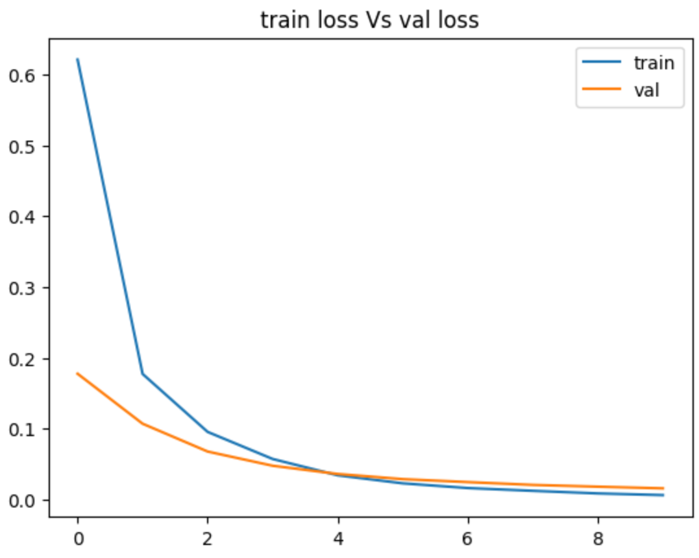
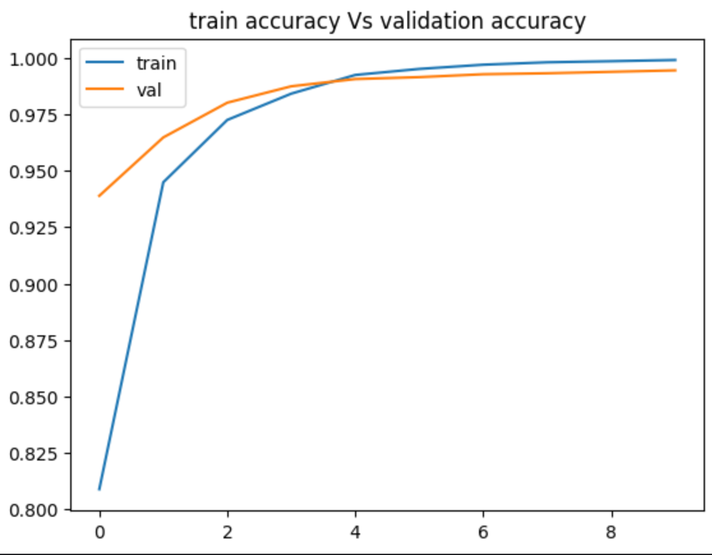
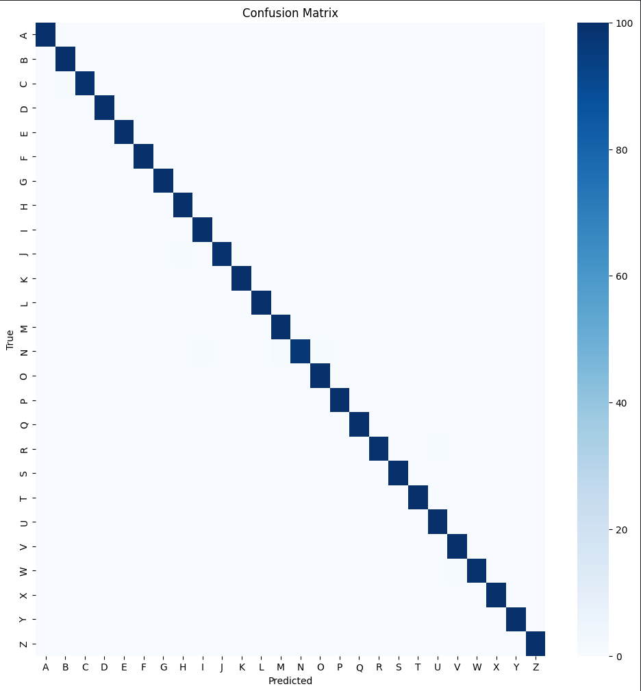
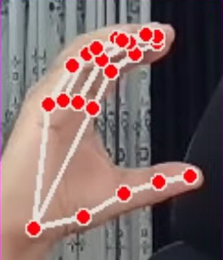
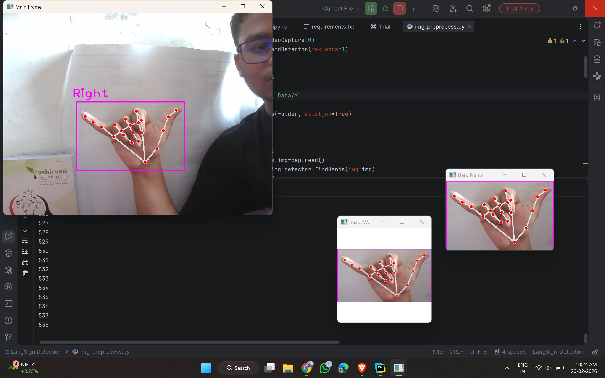

# SignBridge-AI (No AI used for writing this please read)

Here is the some key constrainsts about my project "Sign-Bridge AI" : 

## 1. What Problems it solved?
---> so basically we aolving the comunication gap between the Non-Speaking and the Speaking(Or we can say Normal people who has ability to speak) by using this software they can communicate with each other, here the another thing is i have added the multi-lingustic feature that can help to ASL(American Sign Language to any language around the Globe).

## 2.Application Areas : 
-----> we can integrate this thing with the Goverment Sevelent Area where any Deaf is there that can easily communicate with the around the people , TV channels for Deaf is can be accesibe for the Normal people by using this , i think no limitation we will intergrate this thing in the every plcae where the Deaf people is operation 

## 3.Why i make this project?
-----> here the goal is simple to help those people that is lacking because they does not have the voice so that is the major reason to devlop this project

## 4.What is unique than others?
-----> In the LinkedIn or the any platform i can found this type of the "sign language detection models" but i think to go beyond that and i have added the additional functionality it means end-to-end communication pipeline (HandSign -> detection -> speak -> in multilanguage support ). so this thing is uniqly made by my own idea and creation  

## 5.What Domain expertise that i have put in this project ? 
----> Be honest with your self i have put all the topics that i learned before like LLM(Mobile-Net-V2) , Finetunning(100-155 layers till i fune tunned) , for the sentence suggestion i use the NLP(text processing -> prediction) , OpenCV(image capturing and the image preprocessing) , web sockets (frames are not lagging by using this) , Speech modules (for speaking in the multi-language)

## 6.Which platform i use to deploy this project?
-----> I used the AWS -> EC2 -> t3-small-instance for deploying 

<h2>📸 Project Screenshots</h2>

<h3>Train Vs Val Loss</h3>

<h3>Train Vs Val Accuracy</h3>

<h3>Confusion Matrix</h3>

<h3>Translation Feature</h3>

<h3>Custom Dataset Creation</h3>

